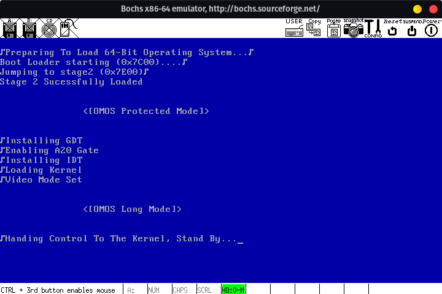

# IncroOS

An educational x86-64 operating system built from scratch - featuring a multi-stage FAT32 bootloader, a 64-bit freestanding C kernel, physical and virtual memory management, VGA output, and serial debugging.

> This project is purely for educational purposes, created to explore low-level systems programming and OS development concepts.



---

## Table of Contents

- [What It Does](#what-it-does)
- [Features](#features)
- [Architecture Overview](#architecture-overview)
- [Getting Started](#getting-started)
  - [Prerequisites](#prerequisites)
  - [Building](#building)
  - [Running](#running)
- [Project Structure](#project-structure)
- [Contributing](#contributing)
- [Resources](#resources)
- [Author](#author)

---

## What It Does

IncroOS boots from a FAT32-formatted disk image through a custom multi-stage bootloader, transitions the CPU from 16-bit real mode to 64-bit long mode, and hands control to a freestanding C kernel. The kernel initialises a physical memory manager, a 4-level virtual memory manager, a heap allocator, a VGA text terminal, and a serial output channel.

---

## Features

- **Multi-stage FAT32 bootloader** - MBR -> Stage 1 -> Stage 2; transitions through real -> protected -> 64-bit long mode
- **64-bit freestanding kernel** - compiled with GCC (`-mcmodel=large -ffreestanding`)
- **Physical memory manager (PMM)** - bitmap-based 4 KB page allocator over 4 GB of address space
- **Virtual memory manager (VMM)** - 4-level paging (PML4 -> PDPT -> PD -> PT) with map/unmap/query
- **Kernel heap (kmalloc/kfree)** - first-fit allocator with block coalescing over a 512 KB heap
- **VGA text mode terminal** - 80×25 with full 16-colour palette, backed by VGA memory at `0xB8000`
- **Serial port driver** - COM1 at 115200 baud with loopback self-test; mirrors all terminal output
- **Kernel logger** - six log levels (TRACE -> PANIC) with CPU-ID and interrupt-state tracking
- **CMake build system** - reproducible builds with NASM assembly and GCC C sources
- **Docker support** - multi-stage Dockerfile builds toolchain, emulator, and OS image
- **Bochs & VirtualBox** - ready-to-use emulator config and VirtualBox automation script

---

## Architecture Overview

```
┌────────────────────────────────────────────────────────────────────┐
│  BIOS                                                              │
│    └─► MBR (boot/mbr.asm)         - relocates, jumps to Stage 1   │
│          └─► Stage 1 (Boot1.asm)  - reads FAT32, loads STAGE2.SYS │
│                └─► Stage 2        - loads KRNLDR.BIN, sets up GDT  │
│                      └─► Kernel (kernel/kernel.c::kMain)           │
│                            ├─ PMM  (bitmap page allocator)         │
│                            ├─ VMM  (4-level page tables)           │
│                            ├─ kmalloc (heap allocator)             │
│                            ├─ Terminal (VGA 80×25)                 │
│                            └─ Serial  (COM1 @ 115200 baud)         │
└────────────────────────────────────────────────────────────────────┘
```

**Memory layout at boot:**

| Range | Size | Purpose |
|---|---|---|
| `0x0000_0000 – 0x0000_04FF` | 1.25 KB | Reserved (BIOS/IVT) |
| `0x0000_0500 – 0x0000_7AFF` | ~29 KB | Stage 2 bootloader |
| `0x0000_7B00 – 0x0000_7BFF` | 256 B | Stack |
| `0x0000_7C00 – 0x0000_7DFF` | 512 B | Stage 1 |
| `0x0000_7E00 – 0x0007_FFFF` | ~480 KB | Kernel loading bay |
| `0x0014_0000` | - | PMM bitmap base |
| `0x0018_0000 – 0x0020_0000` | 512 KB | Kernel heap |

---

## Getting Started

### Prerequisites

Install the required system packages (Ubuntu/Debian):

```sh
bash vendor/required.sh
```

This installs: `git`, `gcc`, `g++`, `nasm`, `make`, `curl`, `cmake`, `ninja-build`, `python3`, and graphics/math libraries needed for Bochs.

#### Building Bochs from source (recommended)

Download Bochs from [bochs.sourceforge.io](https://bochs.sourceforge.io) and build it with:

```sh
./configure \
  --with-x11 --enable-plugins --enable-debugger --enable-smp \
  --enable-x86-64 --enable-svm --enable-avx --enable-long-phy-address \
  --enable-all-optimizations --enable-ne2000 --enable-pnic --enable-e1000 \
  --enable-usb --enable-usb-ohci --enable-usb-ehci --enable-usb-xhci \
  --enable-raw-serial
make && sudo make install
```

### Building

1. **Clone with submodules:**

   ```sh
   git clone --recurse-submodules -j8 git@github.com:MeulenG/MFOS.git
   cd MFOS
   ```

   If you already cloned without `--recurse-submodules`:

   ```sh
   git submodule update --init --recursive
   ```

2. **Configure and build with CMake:**

   ```sh
   cmake -S . -B build -G Ninja
   cmake --build build
   ```

   Build artifacts are written to `build/`:

   | File | Description |
   |---|---|
   | `BOOT.SYS` | Stage 1 bootloader binary |
   | `STAGE2.SYS` | Stage 2 bootloader binary |
   | `KRNLDR.BIN` | 64-bit kernel binary |
   | `disk.img` | 2 GB bootable FAT32 disk image |

3. **CI / automated build:**

   ```sh
   bash scripts/run-ci-local.sh
   ```

   Pass `--help` to see available options (artifact directory, skip flags, etc.).

4. **Docker build:**

   ```sh
   docker build -t incro-os .
   ```

### Running

#### Bochs (recommended)

```sh
bochs -f bochs/bochsrc
```

Serial output is written to `serial.txt`. Bochs debug output goes to `bochsout.txt`.

#### VirtualBox

```sh
python3 VM.py setup_VM   # create and configure the VM
python3 VM.py run_VM     # start it
```

The script creates a 4 GB VM with an AHCI SATA controller and attaches `disk.img`.

---

## Project Structure

```
IncroOS/
├── boot/                   # Bootloader (NASM assembly)
│   ├── mbr.asm             # MBR stage
│   ├── fat32/
│   │   ├── Boot1.asm       # Stage 1 - FAT32 parser, loads Stage 2
│   │   └── Stage2_X86.asm  # Stage 2 - mode transitions, loads kernel
│   └── includes/           # Shared assembly macros & definitions
├── kernel/                 # 64-bit C kernel
│   ├── kernel.c / kernel.h # Entry point (kMain)
│   ├── cpu/io.h            # Port I/O helpers
│   ├── drivers/            # serial.c, vga.h
│   ├── memory/             # pmm.c, vmm.c, kmalloc.c
│   ├── output/             # terminal.c - VGA text terminal
│   ├── logger/             # klogger.c - multi-level kernel logger
│   └── lib/print.c         # Utility print routines
├── cmake/external/         # Vendored CMake packages (jansson, lua, zstd)
├── External/bake/          # Disk image builder (git submodule)
├── bochs/bochsrc           # Bochs emulator configuration
├── scripts/run-ci-local.sh # Local CI helper script
├── builder.yaml            # Disk image schema (MBR + FAT32 partition)
├── Dockerfile              # Multi-stage container build
└── VM.py                   # VirtualBox automation
```

---

## Contributing

Contributions are welcome. Please open an issue first to discuss significant changes.

If you spot a bug or want to add a missing kernel subsystem, feel free to fork the repository and submit a pull request.

---

## Resources

This project draws on the following references:

- [OSDev Wiki](https://wiki.osdev.org) - comprehensive OS development reference
- [Brokenthorn OS Development Series](http://www.brokenthorn.com/Resources/) - bootloader and kernel tutorials
- [NASM Manual](https://nasm.us/doc/) - x86 assembler documentation
- [Intel 64 and IA-32 Architectures SDM](https://www.intel.com/content/www/us/en/developer/articles/technical/intel-sdm.html) - CPU architecture reference

**Toolchain:** [CMake](https://cmake.org) · [NASM](https://nasm.us) · [GCC](https://gcc.gnu.org) · [Bochs](https://bochs.sourceforge.io)

---

## Author

**[@MeulenG](https://github.com/MeulenG)**
